  

 

  

 

  

 

  

  
  &nbsp;
  
  &nbsp;
  

  

  

  

<!--
  The panels are generated. To change text, tech or links, edit the `profile`
  object in scripts/generate.ts and run:  node scripts/generate.ts   (Node 22.18+)
-->
